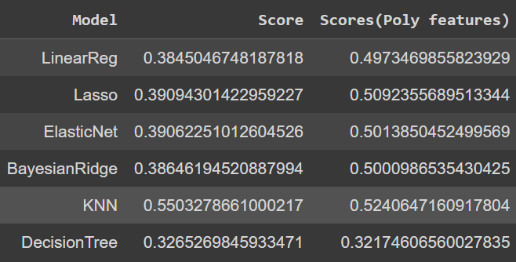
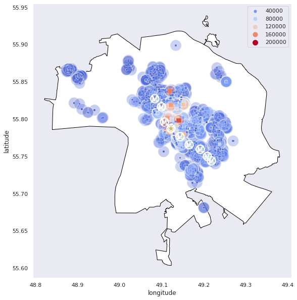
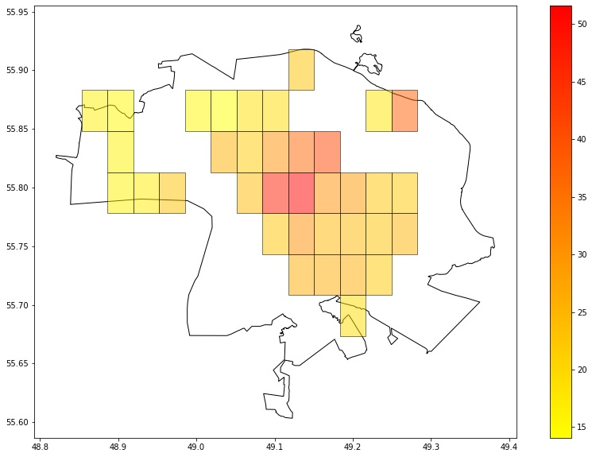
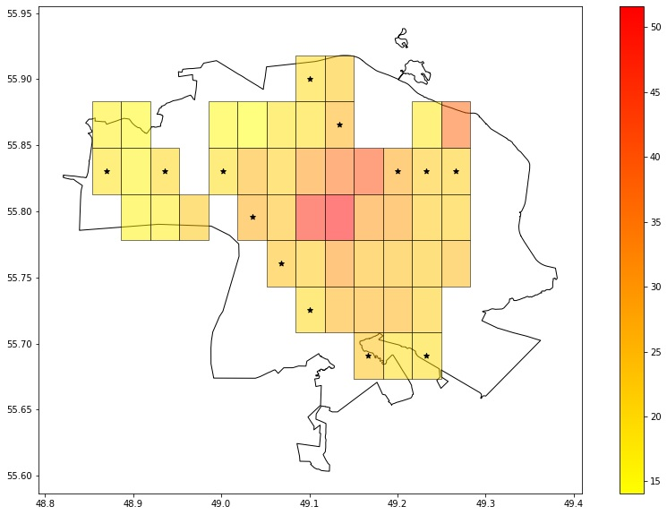

# Kazan Rental price research
This project is a my personal pet project for showcase my abilities. Other my projects or Kaggle Notebooks can be found at [my github](https://github.com/siva4iov).

## Status

## Project Intro
The purpose of this project is to investigate the state of rental prices in the Kazan city. 

The main reason for creating this project is to demonstrate my abilities in data analysis and  ML models creation.

### Methods Used
* Web Scraping
* Inferential Statistics
* Machine Learning
* Data Synthesis
* Predictive Modeling
* Data Visualization

### Technologies
* Python
* requests, BeatifulSoup
* Pandas, jupyter
* sklearn
* CatBoost
* XGBoost
* Matplotlib, Seaborn
* Geopandas, geopy
* SDV
## Project Description
__Data sources__:

The dataset consists entirely of ads from the Avito website placed in the public domain.

The data is anonymized and does not contain personal information.

All data was obtained by Web Scraping (code written by me) that satisfies all the rules of the platform.

The data contains only information about the apartments, such as area, number of rooms, address and (most importantly!) price.

__Questions explored__:

The main question that this project answers is which areas of the city are the most expensive and which are affordable.

My main hypotheses that the price is most influenced by the distance to the center and to the nearest metro station were justified

__Geocoding__:

Geodata play an important role in this project. So I had to use libraries and approaches to process this data that I had never dealt with before.

I am limited in resources, so I had to use only free solutions, which do not always work. Therefore, a certain amount of data had to be abandoned because it was impossible to process them.

Of course, I could manually process this data, because there are not so many of them. But that's not the approach I'm looking for.

__Model__:

It just so happens that this is a regression problem.
I decided to start with basic linear and non-linear models, and some of the results surprised me. Specifically the [KNeighborsRegressor](https://scikit-learn.org/stable/modules/generated/sklearn.neighbors.KNeighborsRegressor.html) from the `sklearn.neighbors` module.

Next, I decided to use more complex approaches, such as gradient boosting, they gave generally good results.
I came up with the idea to use a win-win option and combine them into an [ensemble](https://scikit-learn.org/stable/modules/generated/sklearn.ensemble.VotingRegressor.html?highlight=votingregressor#sklearn.ensemble.VotingRegressor), which gave not too significant, but an increase in quality (It would take me up several positions if it was Kaggle competition)

When I reached a satisfactory quality of the model, I decided to put it into practice.

__Map Visualization__:

All data is related to a geographic location, so when visualizing it was necessary to depict the map itself and the position on it.

Of particular difficulty was the search for a map containing geodata of the city

When visualized using points, the graph is not very beautiful, although it conveys the essence.

Therefore, I decided to use the approach of dividing the city territory into identical districts and depicting the average price using color.

I liked this style much more and I think it describes the data better.

__Making Predictions__:

The map barely covers the area.
But how can I increase the amount of data?
It would be wrong to go through all possible coordinates within the boundaries of the city, invent for each point the number of rooms, repairs and make prediction based on this.

I decided to do something a little different.

My algorithm is as follows:

1. We go through all the "boxes"
2. If there is no data within this territory:
    * We check the neighboring "boxes" (top, bottom, left and right), if there is enough data inside these neighbors, we train the model for data synthesis and create 30 examples
    * For each example, we create coordinates that satisfy the boundaries of the "box" and calculate the distance to the key points
    * We make a price prediction for each example and calculate the average
    * Add this "box" to the map
3. We combine real data with generated data and visualize
4. You are Amazing!

This made it possible to expand the visualization of the map and now it covers more than half of the territory.

### __Result__:
As a result, we have a model capable of making price predictions based on apartment characteristics and location. And visualization of the map with the expected average price

## TO-DO

 I have plans to implement a desktop application using pyQt with an interactive map to estimate prices for apartments

## Main Notebooks
All main Notebooks are marked with a serial number at the beginning, more details:
* [1. Data_cleaning.ipynb](1.%20Data_cleaning.ipynb) - Notebook with primary data processing and bringing them to working condition
* [2. Geocoding.ipynb](2.%20Geocoding.ipynb) - Notebook containing code for geocoding addresses to their coordinates

* [3. EDA.ipynb](3.%20EDA.ipynb) - 
Notebook in which primary data analysis is carried out, statistical hypotheses are put forward and tested

* [4. Feature_engineering_and_model_building.ipynb](4.%20Feature_engineering_and_model_building.ipynb) - 
Notebook with the creation of new feautures, as well as the creation and evaluation of various
ML Models
* [5. Predictions_Visualization.ipynb](5.%20Predictions_Visualization.ipynb) - Notebook with visualization of our data on the map, as well as with the generation of new data and the creation of predictions based on them

## Gratitude
Thank you for your attention to my project!